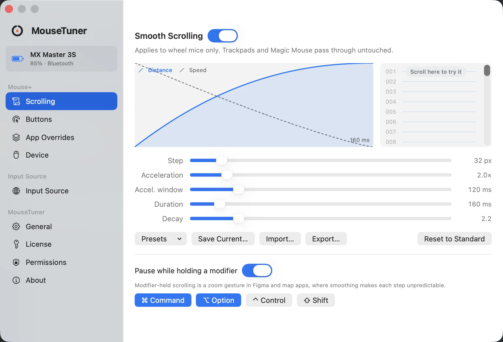
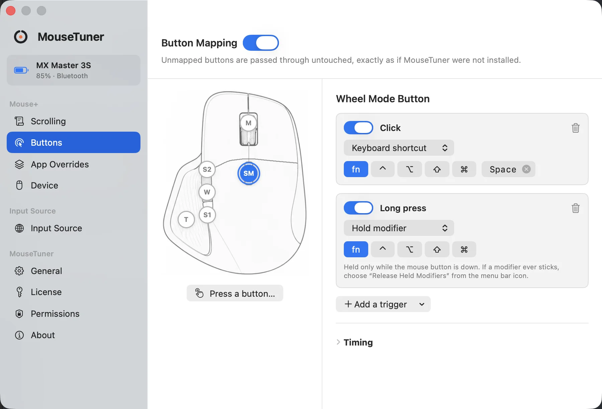
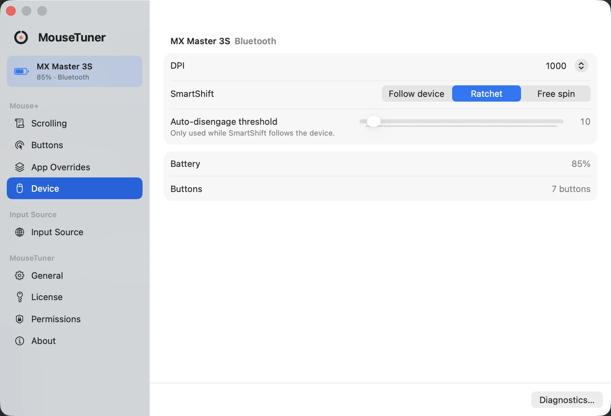
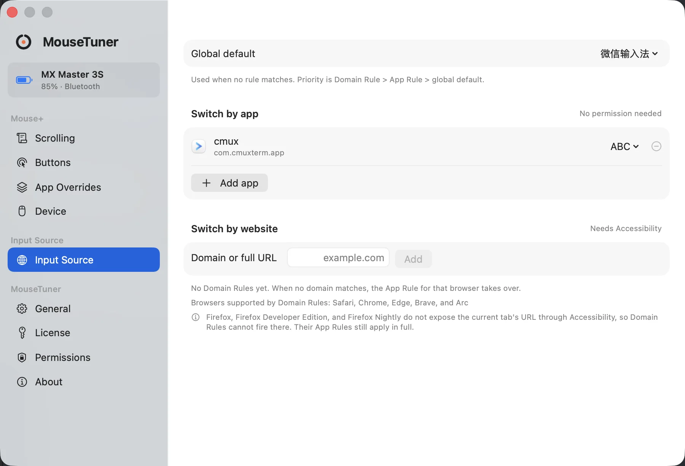

# MouseTuner

[English](README.md) · [简体中文](README.zh-CN.md)

A menu bar app that gives any mouse on macOS the behavior the system leaves out.

<picture>
  <source media="(prefers-color-scheme: dark)" srcset="docs/shots/scroll-dark.webp">
  
</picture>

The Scrolling panel: the Scroll Curve, its five parameters, and a preview that reacts while you drag.

## What it does

- **Smooth scrolling.** Replaces the discrete steps of a wheel mouse with pixel-level inertial scrolling. Trackpads and the Magic Mouse pass through untouched.
- **Scroll inversion.** Flips wheel direction on its own, independently of the system's natural scrolling, so a mouse and a trackpad no longer have to agree.
- **Scroll curve editor.** Tune minimum step, gain, duration and decay, and feel the change as you drag.
- **Button mapping.** A trigger can be a click, a double click, a long press, a four-way drag, a chord of two buttons, or hold plus scroll. An action can send a keyboard shortcut, run a system action, open an app or a URL, or run a script.
- **Modifier hold.** Hold a mouse button to hold a modifier key such as Fn, and release it on button up. This is the hardware half of push-to-talk dictation.
- **Pan while held.** Turn pointer movement into scrolling while a button is down, the way a hand tool works in a map or a canvas.
- **Per-app overrides.** Scroll curves and button mappings can change with the frontmost app.
- **Input source switching.** Switch input sources automatically by app, or by the domain of the current browser tab.
- **Logitech hardware control.** On a recognized device, read and write DPI, SmartShift and battery level over HID++, the protocol the vendor's own software speaks. No vendor software has to be running.

Smooth scrolling and button mapping work with any mouse. The hardware controls need a device MouseTuner recognizes.

## Screens

<picture>
  <source media="(prefers-color-scheme: dark)" srcset="docs/shots/buttons-dark.webp">
  
</picture>

Button Mapping: a button holds a list of triggers, and every trigger points at exactly one action. Both can be overridden per app.

<picture>
  <source media="(prefers-color-scheme: dark)" srcset="docs/shots/device-dark.webp">
  
</picture>

Device: DPI, SmartShift and battery level, read and written over HID++ on a mouse MouseTuner recognizes.

<picture>
  <source media="(prefers-color-scheme: dark)" srcset="docs/shots/inputsource-dark.webp">
  
</picture>

Input sources: switch by app, or by the domain of the current browser tab.

## Requirements

macOS 13.3 or later. Universal binary for Apple silicon and Intel.
